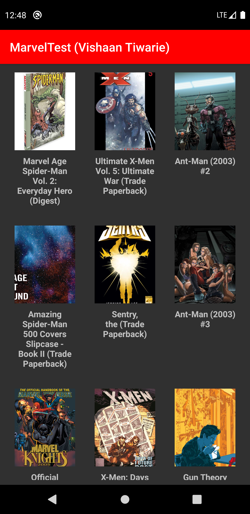
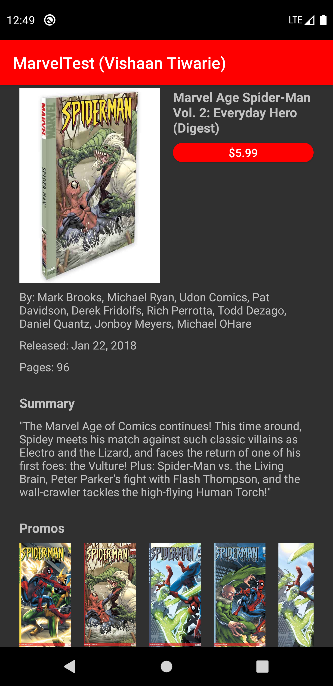

Marvel Test Application by Vishaan Tiwarie

This app was written using the MVP architectural pattern, with
a Master screen (list of comics) and a detail screen to display
comic details.

The comics details displays the title, author(s), price, page count,
release date, summary, and promo images.

The comics data is retrieved with Retrofit and Coroutines
and then parsed with Gson. It is then saved to the ROOM database with an IO context. Room Dao's
uses Coroutines's Flow<T> in order to keep the UI subscribed to the database contents,
and so that our app can reactively update its views whenever database changes are made (we
can easily remove this reactive nature if need be).

----App Technologies----

Kotlin
Coroutines
Retrofit
Gson
Dagger 2
Glide
Room

This app includes 2 simple tests.

One unit test (ListPresenterTest.kt) and one UI test (BasicFlowTest.kt).
